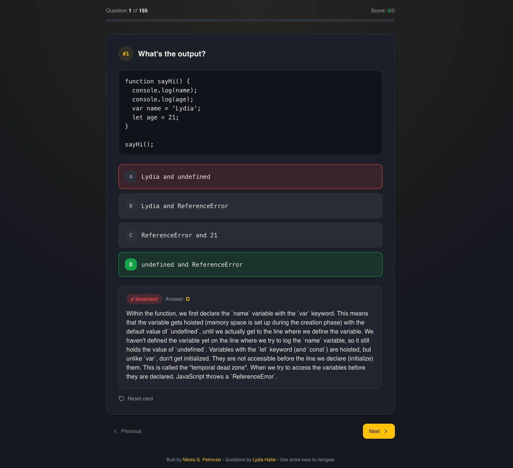

# From Mindless Scrolling to a JavaScript Quiz App

_Published on December 19, 2025_

## From Mindless Scrolling to Something Useful

Usually, before going to bed - or already in bed - I’d catch myself scrolling through reels, jumping between different social media apps without any real purpose. Just wasting precious time that should’ve gone to sleep.

Then one night I thought: if I’m not sleeping anyway, why waste time pointlessly? Why not learn something or read something useful?

Even though my phone is a Pro Max with a big screen, I never really managed to use it like a Kindle or a tablet for reading books. It just didn’t work for me.

## The Interview Questions Idea

Around that time, I had been reading interview questions, mostly JavaScript-related. I started going through them on GitHub, but honestly, it wasn’t a great experience. Every time I opened the page, I’d start from the top again, read the first 10 or 15 questions, and then stop-out of more than 150.

That’s when another thought hit me:

**What if I had a quiz that I could access from anywhere?**

The questions already existed in a [public GitHub repository](https://github.com/lydiahallie/javascript-questions) by Lydia Hallie. All I needed was to fetch the questions from the Markdown file, iterate through them, and deploy the app somewhere. I could’ve done something similar with ChatGPT or Claude, but I specifically wanted a quiz experience.

## Building It (Without Overthinking)

I didn’t want to spend too much time on this. It’s a simple project - almost a junior-level one - and I already knew what needed to be done. So I decided to try one of the free AI tools to scaffold the app quickly and then polish it later.

This was the main prompt I used.

```text
I want you to create a quiz web app using the questions and answers from the following Markdown (.md) file.

Steps:

- First, extract the questions and answers from the file (you may use a script for this).

This should be straightforward since the file is written in Markdown and the questions are numbered.

The answers are located below each question in an accordion-style section.

- Use the extracted data to build the flashcards interface.

- Upload the finished project to GitHub and deploy it on Vercel.

Here is the file you should use:
https://github.com/lydiahallie/javascript-questions/blob/master/README.md

Please read the file first and ask me for clarification before proceeding if anything is unclear.

P.S. To avoid fetching the file at runtime, you may copy the Markdown file directly into the project and read the data from there.
```

Without any specific reason, I chose [lovable.dev](https://lovable.dev), and surprisingly, it did a pretty good job.

After that, I connected it to my GitHub account and deployed it on Vercel.

## The Result

And that was it. I ended up with a JavaScript quiz app containing **155 questions**, all parsed from Lydia Hallie’s repository. The app includes:

- **Dark theme** with JavaScript-inspired yellow accents
- **Code syntax highlighting** using the JetBrains Mono font
- **Progress tracking** with score and accuracy
- **Shuffle & Reset** functionality
- **Keyboard navigation** (arrow keys)
- **Completion screen** with shareable results



You can check it on the following link: https://jsquizz-ngp.vercel.app/.

## A Better Alternative to Scrolling

And I actually did it. Instead of endlessly scrolling through Instagram or Facebook feeds full of mostly useless content, I now had a much better alternative - something that actually helps me learn.

## What’s Next?

I could easily connect this to a database like Supabase and add user profiles with progress tracking. I’m also thinking about adding different types of questions: Python, React, Next.js, Vue, and more.

But that might be a topic for another blog post.